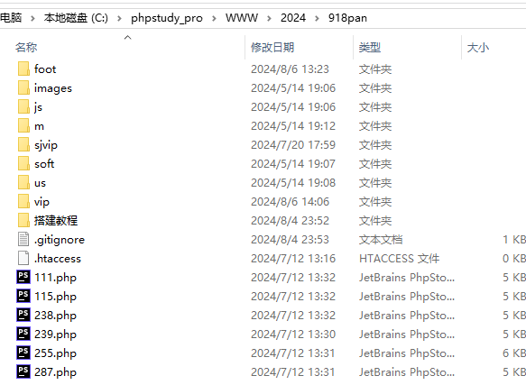

# php新中原六合彩信用盘源码-中原三合一信用盘源码-OA信用盘源码
一个PHP语言开发的六合彩信用盘系统：中原三合一信用盘。支持3个彩种：澳门六合彩、香港六合彩、台湾六合彩；彩种名称可以自定义修改。这是一款专门为六合彩收单信用盘开发的PHP开源系统。查看php新中原六合彩信用盘源码搭建演示站联系官方技术：cp567.cc

## 专业搭建六合彩信用盘-新中原三合一信用盘
- 技术官网：专业[搭建六合彩信用盘](https://www.tuku325.cc/?cate=4), www.tuku325.cc

[搭建六合彩信用盘](https://www.tuku325.cc/?cate=4)
[搭建新中原三合一信用盘](https://www.tuku325.cc/?tags=305)
海峡六合彩信用盘
搭建新中原六合完美信用盘
搭建中原OA信用盘

## 中原三合一信用盘源码搭建
- 运行环境：Apache + MySQL + PHP 注意： PHP版本需在5.6及以上 Apache版本需在2.4及以上
- SQL文件说明 db.sql 演示数据
- 用户名：admin 密　码：123456
- 安全码：6666
- 
## 中原三合一信用盘源码截图

## 版权信息

新中原三合一香港六合彩完美信用盘程序源码,澳门六合彩盘口源码搭建。

版权所有Copyright © 2017-2025 by 老李[六合彩信用盘搭建](https://www.tuku325.cc/) ([https://www.fastadmin.net](https://www.tuku325.cc/))

All rights reserved。
